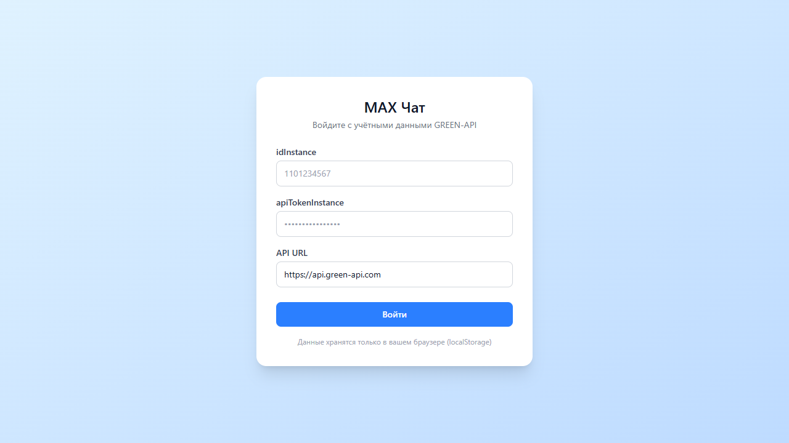
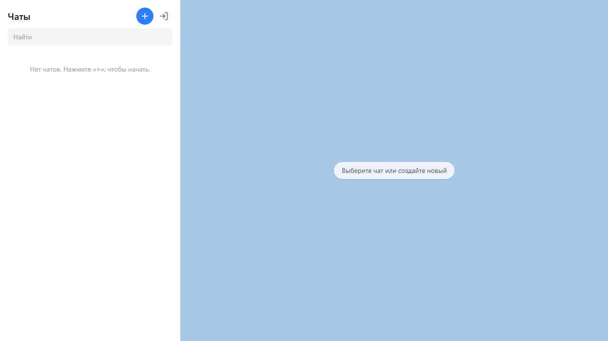
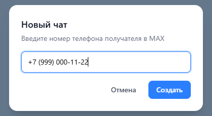

# MAX Chat — GREEN-API

SPA на React для отправки и получения текстовых сообщений в мессенджере MAX через [GREEN-API v3](https://green-api.com/max). Бэкенда нет — все запросы идут из браузера напрямую в GREEN-API. Внешний вид повторяет прототип [web.max.ru](https://web.max.ru/).



## Стек

- **Vite + React 18 + TypeScript (strict)**
- **Redux Toolkit** — весь доменный стейт: учётные данные, чаты, сообщения, тосты
- **Tailwind CSS 4** — вёрстка без UI-библиотек, условные классы через `clsx` + `tailwind-merge`
- **Vitest + React Testing Library + MSW** — unit/component-тесты (26 тестов)

## Быстрый старт

```bash
npm install
npm run dev
```

Приложение откроется на http://localhost:5173

Прочие команды:

```bash
npm run build   # продакшн-сборка (tsc + vite)
npm test        # запуск тестов (vitest run)
```

## Как получить учётные данные GREEN-API

1. Зарегистрируйтесь в [личном кабинете GREEN-API](https://console.green-api.com/).
2. Создайте инстанс и выберите API для **MAX**.
3. Авторизуйте инстанс: отсканируйте QR-код приложением MAX (или авторизуйтесь по номеру телефона) — статус инстанса должен стать «Авторизован».
4. Скопируйте `idInstance` и `apiTokenInstance` со страницы инстанса.
5. Обратите внимание на хост API: у разных инстансов он свой (например, `https://7103.api.green-api.com`). Поле «API URL» в форме входа редактируемое, по умолчанию — `https://api.green-api.com`.

## Как пользоваться

1. Введите `idInstance`, `apiTokenInstance` и API URL — приложение проверит авторизацию инстанса методом `getStateInstance`.
2. Нажмите «+» и введите номер телефона получателя (маска `+7 (XXX) XXX-XX-XX` подставляется автоматически).
3. Напишите сообщение и отправьте — оно уйдёт в MAX получателю.
4. Ответ получателя появится в чате автоматически (long-polling уведомлений).





## Архитектура

```
src/
  api/greenApi.ts        // типизированный клиент GREEN-API (sendMessage / receiveNotification / deleteNotification / getStateInstance)
  store/                 // Redux Toolkit: auth, chats, ui (тосты) + персистентность в localStorage
  services/polling.ts    // цикл receive → dispatch → deleteNotification (AbortController, экспоненциальный backoff)
  hooks/                 // useSendMessage, типизированные useAppDispatch/useAppSelector
  components/            // AuthForm, ChatList, ChatWindow, MessageList, MessageBubble, MessageInput, NewChatDialog, Toaster
  types.ts               // типы вебхуков, сообщений, чатов + type guard isIncomingTextWebhook
```

Ключевые решения:

- **Поллинг**: `receiveNotification` — деструктивное чтение очереди. Сервис `polling.ts` получает уведомление, диспатчит его в Redux и **всегда** удаляет через `deleteNotification` (иначе GREEN-API пришлёт его повторно). Нетекстовые вебхуки игнорируются, но тоже удаляются из очереди.
- **Персистентность**: учётные данные и история чатов хранятся в `localStorage` (история привязана к `idInstance`) и переживают перезагрузку страницы.

## Тестирование

```bash
npm test
```

35 тестов: Vitest + React Testing Library, HTTP мокается через MSW. Покрыты: форма входа (валидация, успех, ошибки API), диалог нового чата (маска, валидация), поле ввода сообщения (отправка, ошибка, пустой ввод), список сообщений (пустое состояние, разделители дат, статусы), сервис поллинга (обработка и удаление уведомлений, backoff после ошибки), утилиты номера телефона.
